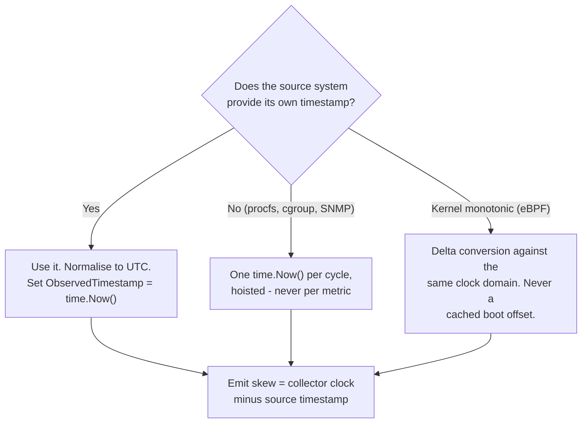

# Telegen — AI Agent Instructions

**Telegen** (`github.com/mirastacklabs-ai/telegen`) is the **unified telemetry collection agent** for the MIRASTACK observability platform. It ingests metrics, logs, traces, profiles, and events from infrastructure, applications, and cloud services, then exports them via OTLP to time-series databases (VictoriaMetrics, VictoriaLogs, VictoriaTraces) and analytics backends (ClickHouse, OpenSearch).

Telegen is a **separate public repository** from the main MIRASTACK monorepo. It does not inherit any conventions automatically; this document establishes the engineering contract for all contributors.

---

## Design Philosophy

1. **Zero hardcoded values, zero dummy code.** All configuration is explicit. No `"default"` tenant, no placeholder endpoints, no stub implementations.

2. **Source code is the ultimate source of truth.** Read existing collector implementations before modifying. When in doubt about timestamp handling, refer to the precedents listed in the DO NOT TOUCH section below.

3. **Enterprise-grade quality.** Proper error handling, graceful degradation, thread safety. No panics in production paths. Telegen runs 24/7 on customer infrastructure; crashes are not acceptable.

4. **Two operating modes:**
   - **Agent mode**: deployed on every monitored host, collects local metrics (node_exporter, eBPF, logs, cAdvisor, profiles). Pushes via OTLP HTTP/gRPC to the platform.
   - **Collector mode**: centralized instance, pulls from external APIs (VMware vCenter, NetApp ONTAP, Arista gNMI, SNMP, cloud APIs). Typically one collector per environment.

5. **Pluggable collectors.** Each collector is a Go package under `internal/{domain}/`, registered in `cmd/telegen/main.go`. Collectors implement a common interface and are started/stopped by the manager.

---

## Timestamp Provenance — Non-Negotiable Rules

**This is the primary contract for all Telegen collectors.** Violations cause data staleness, clock-skew artifacts, incorrect rate calculations, and obscure chart bugs. The six-hour Phoenix outage (2026-08-13) was caused by wholesale violations of rule 1 across VMware, NetApp, and NetInfra collectors.

### The Contract



1. **Capture at the authority.** If the source hands you a timestamp (vCenter `PerfSampleInfo.Timestamp`, ONTAP `statistics.timestamp`, gNMI `notification.Timestamp`, Kubernetes `event.LastTimestamp`), use it. `time.Now()` is a fallback, never a default. When the source provides per-record timestamps, use them per record — never collapse a batch onto a single collection instant.

2. **Carry an absolute instant.** Timestamps on the write path must be UTC epoch (milliseconds for OTLP metrics/logs, nanoseconds for traces, seconds for Prometheus). Keep `ObservedTimestamp` (OTLP) or equivalent separately so collection lag remains measurable. Never discard timezone information during conversion; normalise to UTC and log the original zone when debugging.

3. **Expose the disagreement.** Emit a clock-skew metric (collector clock minus newest source timestamp) so a misconfigured NTP or VM clock announces itself in the same telemetry pipeline. Warn when skew exceeds a configurable threshold (default 5 minutes). Increment a fallback counter when source timestamps are missing or unusable.

### Precedent: Kubernetes Logs (Correct Implementation)

This is the **gold standard** for timestamp handling in Telegen. When a source provides multiple candidate timestamps, try them in order of reliability and fall back to `time.Now()` only when all are zero:

```go
// internal/kubemetrics/logs_streaming.go:346-358 (verbatim copy from source)
timestamp := event.LastTimestamp.Time
if timestamp.IsZero() {
    if event.EventTime.Time.IsZero() {
        timestamp = time.Now()
    } else {
        timestamp = event.EventTime.Time
    }
}

logs = append(logs, OTLPLogRecord{
    Timestamp:         timestamp,
    ObservedTimestamp: time.Now(),
    SeverityNumber:    severityNumber,
    SeverityText:      severityText,
    Body:              event.Message,
    Attributes:        attrs,
    Resource:          l.resource,
})
```

**Key lessons:**
- Source timestamp wins (event.LastTimestamp → event.EventTime → time.Now(), in that order).
- `ObservedTimestamp` is always `time.Now()` at collection time, never the source time.
- Each log record gets its own timestamp; batches are never collapsed onto one instant.

### Rules for Collector Authors

1. **Read the source timestamp field.** Check the API documentation. Examples:
   - VMware: `[]types.PerfSampleInfo[n].Timestamp` (use the **last** sample in the array, not the first — that's the newest data point).
   - NetApp ONTAP KeyPerf: `statistics.timestamp` (ISO-8601 string, parse it).
   - NetApp E-Series: `observedTimeInMS` (epoch milliseconds, already in the JSON response).
   - Arista gNMI: `notification.Timestamp` (protobuf field 1, int64 nanoseconds since Unix epoch).
   - Kubernetes: `event.LastTimestamp` → `event.EventTime` (both are `metav1.Time`).

2. **Normalise to UTC.** If the source returns local time with a timezone, convert it:
   ```go
   t, err := time.Parse(time.RFC3339, "2026-08-13T14:30:00-07:00")
   if err != nil { /* handle */ }
   utc := t.UTC()
   epochMs := utc.UnixMilli()
   ```
   If the format is non-standard (e.g., NetApp's `"2026-08-13T14:30:00-0700"` with no colon in the offset), use `internal/timeutil` helper functions (created in Phase 2 of the clock-skew-defenses plan).

3. **One `time.Now()` per collection cycle, hoisted.** When source timestamps are unavailable (procfs, cgroup reads, SNMP sysUpTime, VMware inventory gauges), call `time.Now()` **once** at the start of the cycle and stamp every metric from that cycle with the same instant:
   ```go
   // Correct: hoisted timestamp
   now := time.Now()
   for _, entity := range entities {
       for _, counter := range entity.Counters {
           metrics = append(metrics, Metric{
               Timestamp: now,  // ← Same instant for all metrics in this cycle
               Value:     counter.Value,
           })
       }
   }
   ```
   **Never** call `time.Now()` inside the loop. Precedent: `internal/metrics/host/host.go:36` → `c.cachedTimestamp = time.Now().UnixMilli()`.

4. **Monotonic-to-wallclock conversion (eBPF, profilers).** Kernel events carry monotonic timestamps (nanoseconds since boot, from `CLOCK_MONOTONIC` or `CLOCK_BOOTTIME`). Convert them using the **delta method**:
   ```go
   func convertMonotonic(eventMono int64) time.Time {
       nowWall := time.Now()
       nowMono := monotime.Now()  // same clock domain as eventMono
       delta := time.Duration(eventMono - nowMono)
       return nowWall.Add(delta)
   }
   ```
   **Never** cache a boot-offset constant (e.g., `bootOffset = wallclock - monotonic` computed at startup). NTP adjustments and clock steps invalidate cached offsets, causing timestamps to drift by minutes or hours. Precedents (all correct): `internal/appolly/app/request/span.go:588`, `internal/profiler/profilers.go:36`, `internal/tracers/generictracer/generictracer.go:624`.

5. **Emit clock-skew observability.** When you use a source timestamp:
   ```go
   skewSec := time.Since(newestSourceTimestamp).Seconds()
   // Emit via OTLP (not internal/selftelemetry — that registry never reaches VictoriaMetrics)
   skewGauge.Set(skewSec)  // sign-preserving: negative = collector lags, positive = collector leads
   if math.Abs(skewSec) > threshold.Seconds() {
       log.Warn().Float64("skew_sec", skewSec).Msg("clock skew exceeds threshold")
   }
   ```
   When you fall back to `time.Now()` because the source field was missing or zero, increment a counter. Config example:
   ```yaml
   collectors:
     vmware:
       clock_skew_warn_threshold: 5m  # default 5 minutes
   ```
   Accessor idiom (see `internal/vmwaredef/config.go:75-81`):
   ```go
   func (c *Config) EffectiveClockSkewWarn() time.Duration {
       if c.ClockSkewWarn == 0 {
           return 5 * time.Minute
       }
       return c.ClockSkewWarn
   }
   ```

6. **Use `internal/timeutil` for shared logic.** Created in Phase 2 of the clock-skew-defenses plan. Consolidates:
   - Source timestamp resolution with guarded fallback.
   - Monotonic-to-wallclock conversion (delta method).
   - Skew computation and threshold checks.
   - ISO-8601 / RFC 3339 parsing variants.

### Incorrect Patterns (Never Do This)

```go
// BAD: per-metric clock reads inside a loop
for _, entity := range entities {
    for _, counter := range entity.Counters {
        metrics = append(metrics, Metric{
            Timestamp: time.Now(),  // ← Wrong! This smears the cycle across its full duration.
            Value:     counter.Value,
        })
    }
}

// BAD: discarding source timestamp
notification := gnmi.Notification{Timestamp: sourceNanos}
metrics = append(metrics, Metric{
    Timestamp: time.Now(),  // ← Wrong! The source gave you a better timestamp.
    Value:     notif.Value,
})

// BAD: collapsing batch timestamps
for _, event := range events {
    logs = append(logs, Log{
        Timestamp: collectionTime,  // ← Wrong! Each event has its own timestamp.
        Message:   event.Message,
    })
}

// BAD: cached boot offset for monotonic conversion
var bootOffset time.Duration  // Computed once at startup

func convertMonotonic(mono int64) time.Time {
    return time.Unix(0, mono).Add(bootOffset)  // ← Wrong! Clock steps invalidate this.
}
```

---

## DO NOT TOUCH — Verified Correct Sites

The following uses of `time.Now()` were audited during the clock-skew-defenses project (2026-08-13) and confirmed **correct**. Modifying them is a regression, even though they superficially look like the bug:

### Correct: procfs / cgroup / sysfs reads
- `internal/cadvisor/collector.go:204` — reading `/sys/fs/cgroup` right now means the observation instant is genuinely now.
- `internal/cadvisor/cgroup.go:225`, `:302`, `:434` — ditto.
- `internal/metrics/host/host.go:36` — hoisted instant, stamped coherently across all host metrics. **This is the reference implementation for no-source-timestamp cases.**

### Correct: SNMP (no per-varbind timestamp)
- `internal/snmp/poller.go:206` — hoists one instant per module poll and threads it through. SNMP `sysUpTime` is an uptime counter, not a wall clock. This package is the **reference implementation** for the hoisted-instant pattern.

### Correct: monotonic converters (delta method)
- `internal/appolly/app/request/span.go:588` — delta conversion against `monotime.Now()`.
- `internal/profiler/profilers.go:36` — ditto.
- `internal/tracers/generictracer/generictracer.go:624` — ditto.
- Do not "improve" these by caching a boot-offset table. There is no boot-offset table anywhere in the repo by design.

### Correct: kernel boottime clock
- `internal/discover/watcher_proc_linux.go:11` — uses `CLOCK_BOOTTIME` deliberately, paired against boottime-based `/proc` data.

### Correct: VMware events (already using source timestamp)
- `internal/vmware/events.go:172` — reads `types.Event.CreatedTime`. This is the **one fully correct emission site** in the VMware package. The sibling file `collect.go` (performance metrics) discards `SampleInfo[].Timestamp` and was fixed in Phase 4.
- `internal/vmware/events.go:377` (`stateRecord`) — these are collector-computed diffs between inventory snapshots; no source event exists. `time.Now()` is correct.

### Correct: metric *value* is the current time (not the timestamp)
- `internal/nodeexporter/collector/time_linux.go:48` — `time.Now()` is the gauge's **value** (seconds since epoch), not its timestamp.

### Correct: configuration/inventory endpoints (no sample time)
- `internal/storage/hpe/primera.go` — REST API returns appliance config, not sampled metrics.
- `internal/cloud/unified/collectors/*` — cloud inventory (EC2 instances, S3 buckets, etc.), not time-series.

### Correct: generic eBPF byte readers
- `internal/ebpf/ringbuf.go:267` and `internal/ebpf/perfbuf.go:286` — receive opaque `[]byte` and cannot know the event layout. The timestamp field is named `ObservedTimestamp` honestly.

### Correct: log parser pipeline precedence
- `internal/logs/parsers/types.go:203-214` and `pipeline.go:246-248` — parsed timestamps already win per OTLP spec; `ObservedTimestamp` is always `time.Now()` at collection time. This is correct.

### Correct: duration measurement, cache TTL, rate limiting, retry backoff
- Every `start := time.Now(); /* work */; elapsed := time.Since(start)` is correct. These are not data timestamps.
- Every `if time.Since(lastAttempt) < backoff` is correct.
- Every `cache.Set(key, value, 60*time.Second)` is correct.

---

## Known Issues (Out of Scope, Do Not "Fix")

The following are known bugs or dead code, but they are **out of scope** for the timestamp-provenance work. Flag them in your report; do not silently fix them without a separate task:

1. **`internal/observe/metrics_query_optimized.go:189`** — doc comment claims `MergeChunkResults` skips non-success chunks, but the guard only checks `chunk == nil || chunk.Data == nil` and never reads `chunk.Status`.

2. **`scripts/hardening-gate.sh:28`** — invokes `scripts/hardening-post-wave${WAVE}.sh`, which does not exist. The hardening gate is broken for every wave.

3. **`internal/discover/autodiscover/process_detector.go:212,231`** — hardcode `/100.0` for HZ conversion, while `internal/discover/watcher_proc.go:418-424` correctly calls `sysconf(_SC_CLK_TCK)`.

4. **`internal/pipeline/converters/converter.go:114-122`** — declares `TimestampFromTime()` and `Now()` with **zero call sites** repo-wide. Either fold them into `internal/timeutil` or delete them. Do not leave a dead trap.

---

## Code Quality Standards

1. **No hardcoded values, no fake functions, no dummy code, no stubs.** If you cannot implement it correctly now, return an error and document the limitation.

2. **Source code is the ultimate source of truth.** Read existing collector implementations before modifying. The patterns in `internal/snmp/poller.go`, `internal/kubemetrics/logs_streaming.go`, and `internal/metrics/host/host.go` are the reference implementations for hoisted `time.Now()`, source timestamp precedence, and `ObservedTimestamp` separation.

3. **Enterprise-grade quality.** Proper error handling, thread safety, graceful degradation. Telegen must never panic in production. Use structured logging (`zerolog`), not `fmt.Println`.

4. **Zero regression.** Before modifying a collector, capture the test baseline: `go test ./<pkg>/... 2>&1 | tail -5`. After the edit, the same command must show the same or more passing tests and zero new failures.

---

## Testing and Verification

1. **Unit tests must assert timestamp provenance.** When you fix a collector, write a test that synthesizes source data with known timestamps and asserts they survive export. Example:
   ```go
   func TestVMwareCollector_UsesSourceTimestamp(t *testing.T) {
       sourceTime := time.Date(2026, 8, 13, 12, 0, 0, 0, time.UTC)
       entityMetric := &performance.EntityMetric{
           SampleInfo: []performance.PerfSampleInfo{
               {Timestamp: sourceTime},
           },
           Value: []performance.PerfMetricIntSeries{ /* ... */ },
       }
       // Call emitPerformanceMetrics, collect OTLP output
       // Assert: dataPoint.TimeUnixNano == sourceTime.UnixNano()
   }
   ```

2. **Skew metric tests.** Synthesize a scenario where the source timestamp is 1 hour ahead of `time.Now()` and assert the skew gauge reads `3600` seconds (positive). Negative skew means collector lags.

3. **Regression tests for DO-NOT-TOUCH sites.** Confirm that correct sites (SNMP hoisted instant, monotonic converters, procfs reads) were not modified. Phase 9 of the clock-skew-defenses plan includes a DO-NOT-TOUCH audit via `git diff --stat`.

---

## Build and Test

**CI enforcement:** Telegen uses `golangci-lint` with `forbidigo` rules (`.golangci.yml`) to ban inline `time.Now()` in collector hot paths. Scope: `internal/{storage,vmware,netinfra,snmp}`. Exclusions for duration measurement and cache TTL. See Phase 6 of the clock-skew-defenses plan for the full configuration.

**Local testing:**
```bash
go build ./...
go test ./...
go vet ./...
```

**Integration testing:** Deploy telegen in agent mode on a Linux host and collector mode pointing at a test vCenter/ONTAP cluster. Verify metrics reach VictoriaMetrics with correct timestamps.

---

## Licensing

Telegen is released under the **AGPLv3** license. All code in this repository is open source. See `LICENSE` file at the repository root.

---

## Cross-References

- **MIRASTACK parent repository**: `github.com/mirastacklabs-ai/mirastack` (private monorepo, contains engine, SDKs, plugins).
- **Parent AGENTS.md**: `/Users/aarvee/repos/github/private/mirastack/AGENTS.md` (full MIRASTACK engineering contract).
- **Query-side time handling** (engine to agent): Parent AGENTS.md § "DateTime Handling — Non-Negotiable Rules".
- **Clock-skew-defenses plan**: `/Users/aarvee/.cursor/plans/clock_skew_defenses_076387d0.plan.md` (detailed implementation plan for the timestamp provenance standard).
- **Action tracker**: `mirastack-ui/developer/action-tracker.yaml` (Phase 1-9 implementation tasks).

---

## CLEAR & NON-NEGOTIABLE INSTRUCTIONS FOR AI AGENTS

- **PERFORM END-TO-END READING OF CODE BEFORE ATTEMPTING ANY CODE CHANGES.**
- **NO HARDCODING OF ANY VALUES, NO FAKE FUNCTIONS, NO DUMMY CODE.**
- **NO ASSUMPTIONS, NO GUESSES, NO HALLUCINATIONS.**
- **SOURCE CODE IS THE ULTIMATE SOURCE OF TRUTH.**
- **ALWAYS IMPLEMENT PURE FUNCTIONALITY WITH WORLD-CLASS ENTERPRISE-LEVEL QUALITY.**
- **WHEN DEAD OR UNUSED CODE IS IDENTIFIED, CHECK IF IT WAS SUPPOSED TO BE WIRED (AND WASN'T) OR IF IT IS TRULY DEAD (AND THERE IS A BETTER IMPLEMENTATION ELSEWHERE).**
- **NO REGRESSION ISSUES SHOULD ARISE WHEN FIXING AN EXISTING IDENTIFIED ISSUE.**
- **UNIT TEST CASES ARE 100% MANDATORY.**
- **WHEN IN DOUBT, ASK — DO NOT ASSUME.**
