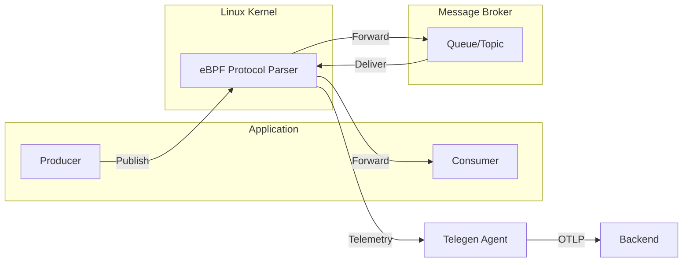

# Messaging Protocol Tracing

Telegen provides deep observability for message queue and event streaming platforms using eBPF protocol tracing. All messaging protocols are detected at the wire level — no client library changes, no SDK instrumentation.

---

## Overview

Telegen traces the following messaging protocols:

| Protocol | Version | Default System | Detection Method |
|----------|---------|---------------|-----------------|
| **Kafka** | All | Kafka | Magic byte `0x00 0x00 0x00 0x00` + API key |
| **AMQP 0-9-1** | — | RabbitMQ | Preface `AMQP\x00\x00\x09\x01` |
| **AMQP 1.0** | — | ActiveMQ | Preface `AMQP\x00\x01\x00\x00` |
| **OpenWire** | — | ActiveMQ | "ActiveMQ" magic string in first 56 bytes |
| **STOMP** | 1.0, 1.1, 1.2 | ActiveMQ | Command matching (SEND, MESSAGE, SUBSCRIBE, etc.) |
| **NATS** | — | NATS | Text-based protocol detection |
| **MQTT** | 3.1, 3.1.1, 5.0 | MQTT | Fixed header detection |

---

## AMQP 0-9-1 (RabbitMQ)

AMQP 0-9-1 is the native protocol used by RabbitMQ. Telegen captures all class/method operations and resolves queue/exchange destinations per channel.

### Detected Operations

| Class.Method | Operation Type | Description |
|-------------|---------------|-------------|
| `basic.publish` (60.40) | `publish` | Publish message to exchange |
| `basic.consume` (60.20) | `create` | Create consumer on queue |
| `basic.deliver` (60.60) | `receive` | Deliver message to consumer |
| `basic.get` / `basic.get-ok` (60.70/71) | `receive` | Synchronous get |
| `basic.ack` (60.80) | `settle` | Acknowledge message |
| `basic.nack` (60.120) | `settle` | Negative acknowledge |
| `basic.reject` (60.90) | `settle` | Reject message |
| `exchange.declare` / `exchange.delete` (40.10/20) | `create` | Declare/delete exchange |
| `queue.declare` (50.10) | `create` | Declare queue |
| `queue.bind` / `queue.unbind` (50.20/50) | `create` | Bind/unbind queue to exchange |
| `connection.open` (10.40) | `create` | Open vhost connection |
| `channel.open` (20.10) | `create` | Open channel |

### Destination Resolution

Telegen combines exchange and routing key to construct the destination:

- Empty exchange → use routing key (direct queue binding)
- Empty routing key → use exchange name
- Otherwise → `exchange:routingKey`

Settle operations (ack/nack/reject) carry no destination in their frames. Telegen uses an **LRU cache per channel** to resolve the originally published/consumed destination.

### Sample Span

```yaml
span:
  name: "basic.publish"
  kind: CLIENT
  duration_ms: 0.8
  attributes:
    messaging.system: "rabbitmq"
    messaging.destination.name: "orders:new"
    messaging.operation.name: "basic.publish"
    messaging.operation.type: "publish"
    messaging.protocol: "amqp"
    messaging.protocol_version: "0-9-1"
    net.peer.ip: "10.0.1.50"
    net.peer.port: 5672
```

---

## AMQP 1.0

AMQP 1.0 is used by ActiveMQ, Azure Service Bus, RabbitMQ, Qpid, and Solace. Telegen detects performatives and resolves addresses via per-link caching.

### Detected Performatives

| Performative | Descriptor | Operation Type | Description |
|-------------|-----------|---------------|-------------|
| `attach` | `0x12` | `create` | Attach link to source/target |
| `transfer` | `0x14` | `publish` / `receive` | Transfer message (request/response) |
| `disposition` | `0x15` | `settle` | Settle delivery (ack/nack) |
| `flow` | `0x13` | `receive` | Flow control update |
| `detach` | `0x16` | `settle` | Detach link |

### Messaging System Disambiguation

AMQP 1.0 is used by multiple brokers. Telegen resolves the correct `messaging.system` using hints derived from:

- Process executable name (`beam.smp` → RabbitMQ, `activemq` → ActiveMQ)
- Container name / K8s labels
- Host port (5672/5671 → RabbitMQ, 61616-61617 → ActiveMQ, 61613-61614 → STOMP)
- User-configured hints

| Hint | Resolved System |
|------|----------------|
| `servicebus` / `azure-servicebus` | Azure Service Bus |
| `artemis` / `activemq` / `openwire` / `stomp` | ActiveMQ |
| `rabbit` / `beam.smp` | RabbitMQ |
| `qpid` / `solace` | JMS |

---

## OpenWire (ActiveMQ)

OpenWire is the native protocol of Apache ActiveMQ.

### Detection

Telegen scans for the "ActiveMQ" magic string within the first 56 bytes of the TCP payload, or matches known command IDs (1, 5, 6, 22, 23).

### Sample Span

```yaml
span:
  name: "openwire.send"
  kind: CLIENT
  attributes:
    messaging.system: "activemq"
    messaging.destination.name: "queue://orders"
    messaging.operation.type: "publish"
```

---

## STOMP

STOMP (Simple/Streaming Text Oriented Messaging Protocol) is supported for ActiveMQ, RabbitMQ, and other STOMP-compatible brokers.

### Detected Commands

| Command | Operation Type | Description |
|---------|---------------|-------------|
| `SEND` | `publish` | Send message to destination |
| `MESSAGE` | `receive` | Receive message from subscription |
| `SUBSCRIBE` | `create` | Create subscription |
| `UNSUBSCRIBE` | `create` | Remove subscription |
| `ACK` | `settle` | Acknowledge message |
| `NACK` | `settle` | Negative acknowledge |
| `CONNECT` / `CONNECTED` | `create` | Establish connection |
| `DISCONNECT` | `settle` | Close connection |

---

## Kafka

Kafka tracing captures:

- **Topic** and **partition** from produce/fetch API requests
- **Consumer group** tracking
- **Broker server-span fallback** (when client spans are unavailable)
- **Consumer lag** metrics

### Configuration

Kafka tracing is enabled by default in the generic tracer. No configuration required.

Broadened detection (since v3.1.18) now covers more Kafka client libraries and wire-level variations.

---

## OpenTelemetry Attributes

All messaging spans include standard OTel semantic conventions:

| Attribute | Description |
|-----------|-------------|
| `messaging.system` | Broker type (kafka, rabbitmq, activemq, etc.) |
| `messaging.destination.name` | Queue, topic, or exchange name |
| `messaging.operation.name` | Protocol-specific method (basic.publish, amqp1.transfer, etc.) |
| `messaging.operation.type` | publish, process, receive, settle, create |
| `messaging.protocol` | amqp, amqp1, openwire, stomp, kafka |
| `messaging.protocol_version` | 0-9-1, 1.0, etc. |

---

## Architecture



Telegen intercepts messaging wire protocols at the kernel level, parsing frames and performatives without modifying application code.

---

## eBPF Implementation

### Generic Tracer (kprobe-based)

- **`bpf/generictracer/protocol_amqp.h`** — AMQP 0-9-1, AMQP 1.0, OpenWire, STOMP detection and frame validation
- **`bpf/generictracer/k_tracer.c`** — Routes MQ protocols to large buffer capture path
- BPF protocol types: `k_protocol_type_amqp = 6`, `k_protocol_type_amqp1 = 16`, `k_protocol_type_openwire = 17`, `k_protocol_type_stomp = 18`

### Go Tracer (uprobe-based)

- **`bpf/gotracer/go_amqp091.c`** — Uprobes for Go `amqp091-go` client library (publish, consume, ack, nack, reject)
- Uses `EVENT_GO_AMQP091 = 17` ringbuf event type

### Parsers (userspace)

| Parser | File |
|--------|------|
| AMQP 0-9-1 | `internal/parsers/amqpparser/amqp.go` |
| AMQP 1.0 | `internal/parsers/amqp10parser/amqp10.go` |
| OpenWire | `internal/parsers/openwireparser/openwire.go` |
| STOMP | `internal/parsers/stompparser/stomp.go` |
| Kafka | `internal/parsers/kafkaparser/` |

### Transform Layer

- **`internal/ebpf/common/amqp_detect_transform.go`** — AMQP 0-9-1 TCP frame → span
- **`internal/ebpf/common/amqp10_detect_transform.go`** — AMQP 1.0 performative → span
- **`internal/ebpf/common/go_amqp091_transform.go`** — Go AMQP 091 uprobe event → span
- **`internal/semconv/messagingsystem_refine.go`** — Dynamic `messaging.system` resolution

---

## Configuration

Messaging tracing requires no explicit configuration — it is enabled automatically when the generic tracer is active.

To filter messaging spans, use the instrumentation options:

```yaml
exports:
  otlp:
    instrumentation:
      # Enable/disable specific messaging protocols
      kafka: true
      amqp: true        # AMQP 0-9-1
      amqp1: true       # AMQP 1.0
      openwire: true
      stomp: true
      nats: true
      mqtt: true
```

---

## Metrics

Messaging tracing does not produce metrics directly — all data is exported as OTLP traces. For queue depth and consumer lag metrics, use the Kafka consumer group metrics or broker-native metrics exported via JMX/API.

---

## Troubleshooting

### AMQP 1.0 system not resolving correctly

Check that the process name or container labels include a hint for the broker type. If using Azure Service Bus, ensure the connection string or hostname includes `servicebus.windows.net`.

### STOMP frames not captured

STOMP requires the client to send the `CONNECT` frame first. Telegen detects STOMP commands after the connection is established. Ensure the STOMP port (default 61613) is included in the generic tracer's port filter.

### RabbitMQ AMQP 0-9-1 ack spans missing destination

This is expected — ack frames carry no destination. Telegen resolves the destination from the LRU cache of the channel. If the cache is cold (first message), the destination may be empty. Increase the LRU cache size if needed.
